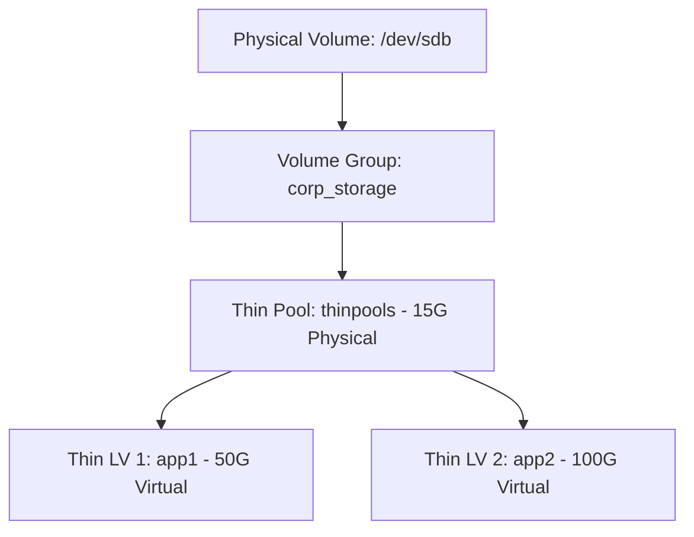

# Enterprise Storage Cost Optimization via LVM Thin Provisioning & Automated Monitoring

[](https://almalinux.org)
[](https://sourceware.org)
[](https://gnu.org)

Demonstrates eliminating over-provisioning and idle storage costs on Linux using LVM2 Thin Provisioning, complete with an automated monitoring script to manage oversubscription risks.

##  Table of Contents
- [The Business Problem](#-the-business-problem)
- [Architecture & Design](#-architecture--design)
- [Lab Environment](#-lab-environment)
- [Step-by-Step Implementation](#-step-by-step-implementation)
- [Automated Monitoring & Remediation Pipeline](#-automated-monitoring--remediation-pipeline)
- [Modern Infrastructure Paradigm: Host vs. Cloud-Native](#-modern-infrastructure-paradigm-host-vs-cloud-native)
- [Skills Demonstrated](#-skills-demonstrated)
- [Deep Dive Articles](#-deep-dive-articles)

---

##  The Business Problem
Traditional provisioning wastes capacity by locking down raw storage based on peak forecasts, leading to high capital expenditure for idle space.

##  Architecture & Design
Thin provisioning decouples logical capacity from physical storage, allowing dynamic allocation.


---

##  Lab Environment
* **OS:** AlmaLinux (RHEL-based)
* **Target:** `/dev/sdb` (20 GB raw)

---

##  Step-by-Step Implementation
1. **PV/VG Setup:** `pvcreate`, `vgcreate`.
2. **Thin Pool:** `lvcreate -L 15G -T corp_storage/thinpools`.
3. **Thin LVs:** `lvcreate -V 50G -T corp_storage/thinpools -n app1`.
4. **Filesystem:** `mkfs.xfs` and mount.

---

##  Automated Monitoring
A Bash script (`thin_monitor.sh`) monitors usage and logs alerts to `syslog`.
```bash
#!/bin/bash
usage=\$(lvs --noheadings -o data_percent corp_storage/thinpools | tr -d ' %')
usage=\${usage%.*}

if [ "\$usage" -ge 70 ]; then
    logger -p user.crit "CRITICAL: Thin Pools usage is \${usage}%"
elif [ "\$usage" -ge 50 ]; then
    logger -p user.warn "WARNING: Thin Pools usage is \${usage}%"
fi
```
*Run via cron every 5 mins*.

---

##  Modern Infrastructure Paradigm: Host vs. Cloud-Native

| Dimension | Host-Level LVM Thin Provisioning | Cloud-Native Approach (AWS / Kubernetes) |
| :--- | :--- | :--- |
| **Capacity Management** | Manual expansion via `lvextend` | Fully automated API expansion |
| **Storage Architecture** | Fixed physical pool oversubscription | Elastic block expansion (EBS) |
| **Monitoring** | Local cron job + `syslog` | Native cloud platform metrics |

---

##  Skills Demonstrated
* **Storage Admin:** LVM2, Device Mapper, XFS.
* **Automation:** Bash scripting, System logging.
* **Infrastructure:** Capacity planning, Cost-containment.

---

##  Deep Dive Articles
*  **[Read full article on my Personal Blog](https://kaybeelog.com)**
*  **[Read full article on Medium](https://medium.com)**
